# 🔬 Melanoma Multimodal Diagnostic System

**Multimodal melanoma detection — 98.3% sensitivity, patient-level validated, EfficientNetV2 + clinical metadata fusion, deployed on GCP.**

A production-grade, end-to-end deep learning system for skin lesion classification built on the **ISIC 2020 dataset**. The system combines dermoscopic image analysis with clinical patient metadata using a **Late Fusion architecture**, and is deployed as a live clinical decision-support tool via a FastAPI backend and a React frontend.

> **Disclaimer:** This system is intended for clinical decision support only. It is not a substitute for professional dermatologist review.

---

## 🏆 Key Results

| Metric                    | Value                     |
| ------------------------- | ------------------------- |
| **AUC-ROC**               | **0.862**                 |
| **Sensitivity (Recall)**  | **98.3%**                 |
| **Specificity**           | 31.53%                    |
| **Optimal Threshold (τ)** | 0.18                      |
| **Dataset**               | ISIC 2020 (33,126 images) |
| **Backbone**              | EfficientNetV2-B0         |

> The threshold τ = 0.18 was deliberately calibrated to **maximise sensitivity** — a clinically critical design choice. In cancer screening, it is far safer to over-refer (false positive) than to miss a malignant lesion (false negative).

---

## 🎬 Live Demo

> Upload a dermoscopic image → fill patient metadata → get a malignancy prediction, Score-CAM heatmap, and uncertainty score.

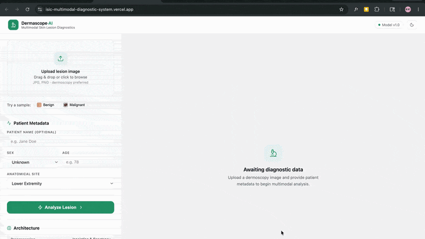

---


## 🧠 Model Architecture — Late Fusion

The core innovation of this system is a **Late Fusion** strategy. Rather than training a single model that takes only one data modality, two parallel branches are trained independently and their outputs are combined at the decision layer, allowing the model to learn the complementary signals from images and patient metadata separately.

```
┌─────────────────────────────────────────┐    ┌────────────────────────────────────────┐
│           IMAGE BRANCH                  │    │          METADATA BRANCH               │
│                                         │    │                                        │
│  Dermoscopic Image (256×256×3)          │    │  Patient Metadata:                     │
│          ↓                              │    │  • Age (normalized)                    │
│  Preprocessing Pipeline                 │    │  • Sex (encoded)                       │
│  (Hair Removal + Ink Removal +          │    │  • Anatomical Site (one-hot, 7 sites)  │
│   Color Constancy + Normalization)      │    │  • n_images_per_patient (log)          │
│          ↓                              │    │          ↓                             │
│  EfficientNetV2-B0 (Frozen Backbone)    │    │  Feature Engineering                   │
│  (Pretrained on ImageNet)               │    │          ↓                             │
│          ↓                              │    │  Metadata Vector (10-dim float32)      │
│  Global Average Pooling                 │    │                                        │
│          ↓                              │    └────────────────────────────────────────┘
│  Image Feature Vector (1280-dim)        │                       │
└─────────────────────────────────────────┘                       │
                    │                                             │
                    └──────────────┬──────────────────────────────┘
                                   │
                          LATE FUSION LAYER
                     Concatenate([1280-dim, 10-dim])
                                   │
                          Dense(256, ReLU) + Dropout
                                   │
                          Dense(128, ReLU) + Dropout
                                   │
                          Dense(1, Sigmoid) → P(malignant)
```

---

## ⚙️ Preprocessing Pipeline

Every dermoscopic image passes through a 5-stage preprocessing pipeline before being fed to the model. This pipeline was designed to remove clinical artifacts that would confuse the model and are not part of the lesion itself.

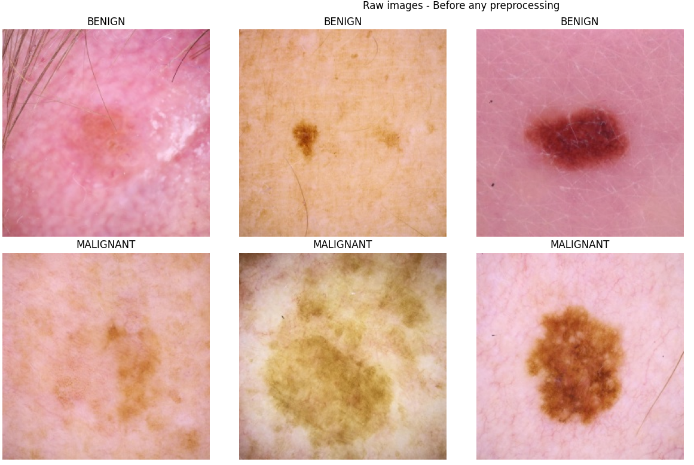

### Stage 1: Resize

All images are resized to a consistent **256×256** resolution.

### Stage 2: DullRazor — Hair Removal

A classical computer vision implementation of the **DullRazor algorithm** using morphological black-hat transforms and OpenCV inpainting to detect and cleanly remove hair occluding the lesion.

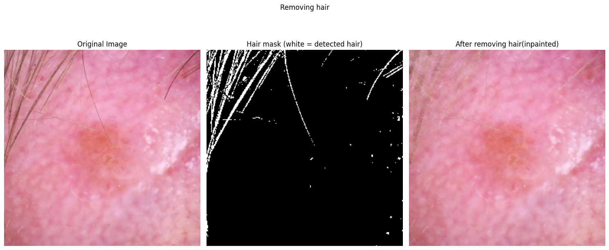

### Stage 3: Surgical Ink Removal

Surgical marker artifacts (blue/purple ink) are detected using **HSV thresholding**. The binary ink mask is dilated using a `7×7` morphological ellipse kernel (`iterations=2`) to capture faint semi-transparent ink edges before inpainting. This dilation step was critical — without it, the inpainting algorithm would drag the faint ink pixels inward, creating dark smudges.

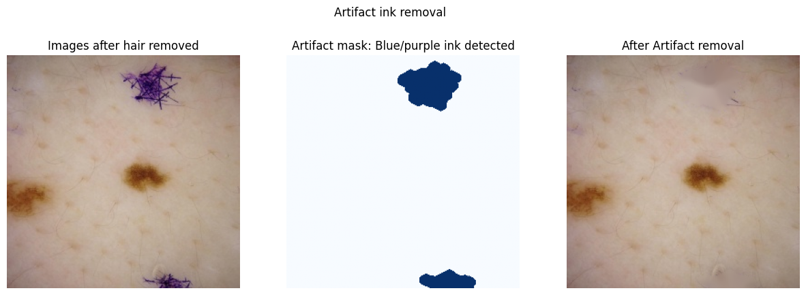

### Stage 4: Color Constancy (Grey World Algorithm)

Dermoscopes from different clinics and camera settings introduce lighting biases that shift the colour space of images. The **Grey World assumption** is applied to normalize illumination across all images, making the model lighting-invariant.

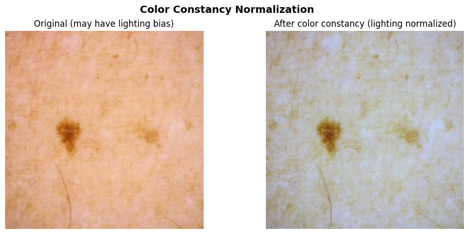

### Stage 5: Pixel Normalization

All pixel values are scaled from `[0, 255]` to `[0.0, 1.0]` (float32).

**Final Result — Before vs. After Full Pipeline:**

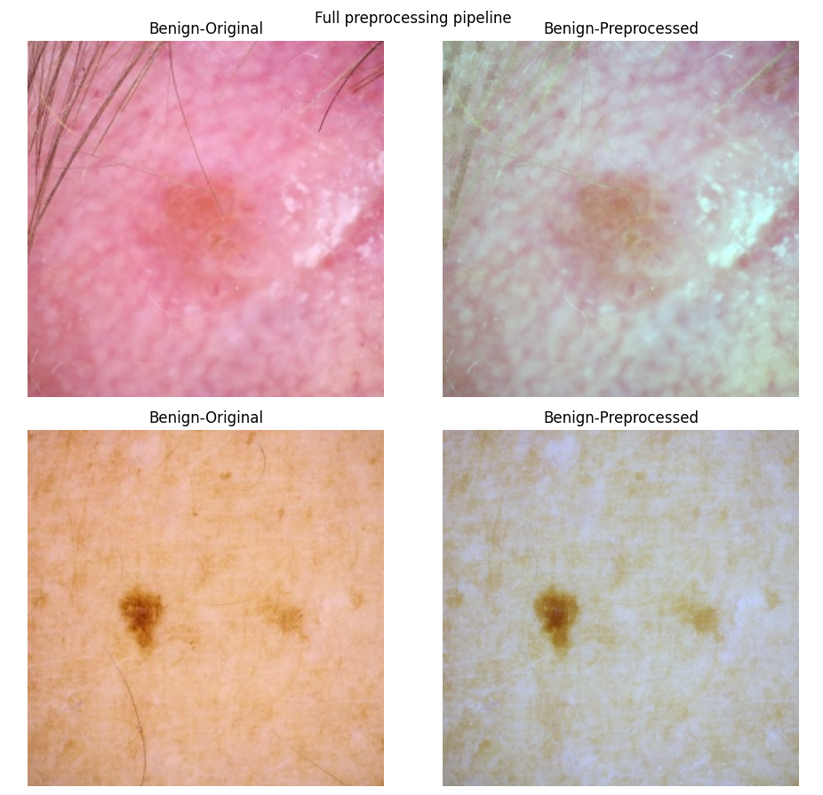

---

## 📊 Dataset Analysis — ISIC 2020

### Class Imbalance

The dataset presents a significant clinical reality: malignant lesions are rare. Only ~2.2% of images are malignant, matching real-world prevalence.

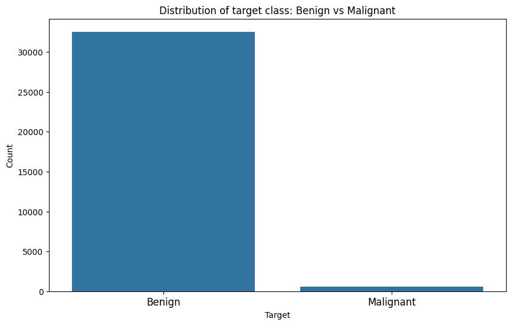

### Melanoma Rate by Anatomical Site

The head/neck and oral/genital regions show the highest melanoma rates, providing strong clinical signal to the metadata branch.

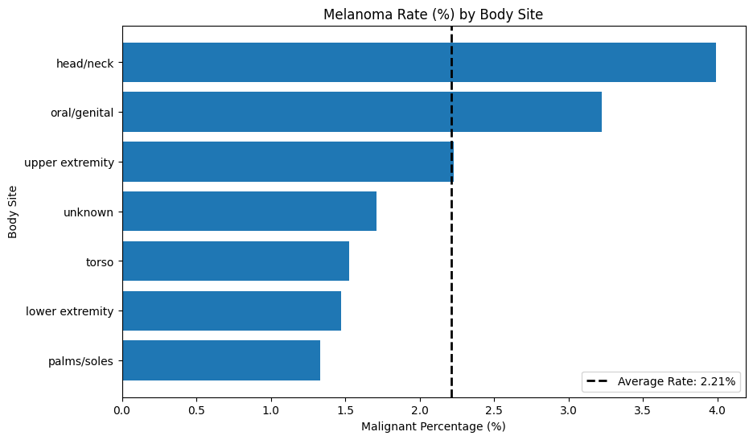

### Metadata Feature Engineering

The raw `n_images_per_patient` feature was right-skewed (most patients have few images, a small number have hundreds). A `log1p` transformation was applied to normalize its distribution and make it suitable as a neural network input.

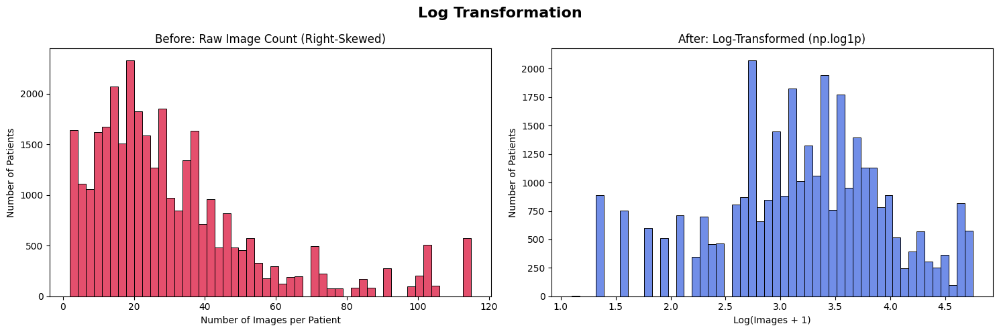

---

## Training Strategy — Two-Phase Approach

Training was done in two phases to prevent catastrophic forgetting and leverage the pre-trained ImageNet weights effectively.

### Phase 1: Linear Probing

The EfficientNetV2-B0 backbone was completely **frozen**. Only the fusion head (Dense layers) was trained. This allows the new classification head to reach a stable optimum before any backbone weights are touched.

### Phase 2: Fine-Tuning

The top layers of the EfficientNetV2-B0 backbone were **unfrozen** and trained with a very low learning rate. This allows the backbone to adapt its high-level feature detectors to the medical image domain without losing the low-level features learned from ImageNet.

---

## 📈 Evaluation Results

### ROC Curve

The system achieves an **AUC of 0.862** on the held-out validation set. The operating point (red dot) shows the chosen threshold of τ=0.22 (original), with the final deployment threshold calibrated to τ=0.18 for higher sensitivity.

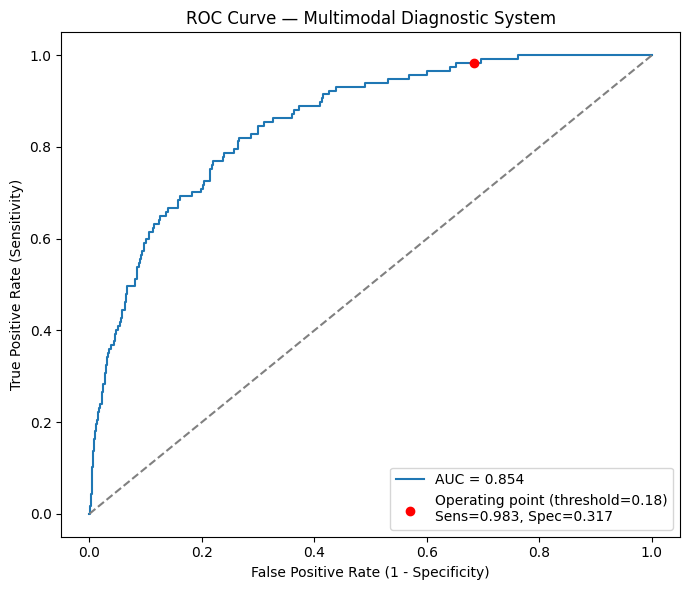

### Confusion Matrix

The confusion matrix below is shown at the reference threshold of τ=0.22 (96.9% sensitivity, 44.1% specificity). The final **deployed threshold is τ=0.18**, which catches **98.3% of all malignant lesions** (115/117), missing only 2 cases, at a specificity of 31.53%.

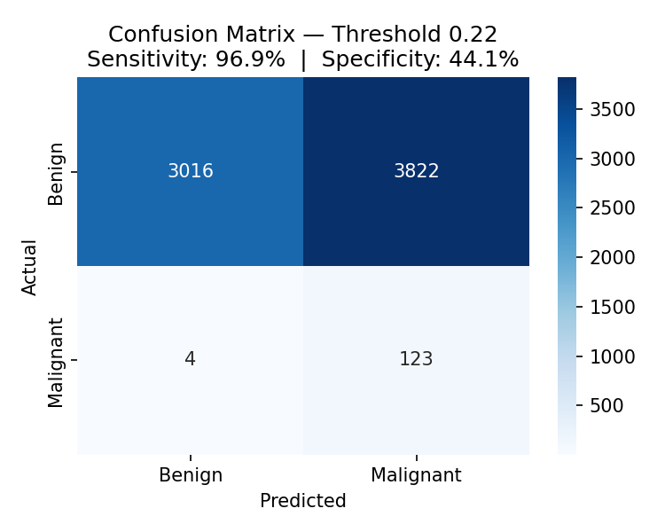

---

## 🔍 Explainability — Score-CAM

The system uses **Score-CAM** (Score-weighted Class Activation Mapping), a gradient-free XAI technique. Unlike standard Grad-CAM, Score-CAM does not require gradient flow back through the model. Instead, it:

1. Extracts the intermediate activation maps from the final convolutional layer.
2. Upsamples each activation map and uses it as a mask applied to the input image.
3. Scores each masked image by running it through the model (196 forward passes for a 14×14 grid).
4. Creates a weighted sum of the activation maps using those scores as weights.

The resulting heatmap highlights exactly which regions of the skin lesion drove the model's malignancy prediction, making each decision interpretable to a clinician.

> **Why Score-CAM over Grad-CAM?** The Late Fusion architecture concatenates two separate input branches. Computing gradients of the output with respect to only the image branch's activations is architecturally ambiguous. Score-CAM bypasses this entirely.

---

## Uncertainty Estimation — MC-TTA

The system uses **Monte Carlo Test-Time Augmentation (MC-TTA)** to measure its own confidence. Instead of a single prediction, the model runs `n=20` forward passes on augmented versions of the input image (random flips, rotations, brightness changes) and reports:

- **Mean Probability** (`mean_prob`): The average malignancy score across all 20 passes — the primary prediction.
- **Standard Deviation** (`std_prob`): A direct measure of model uncertainty. High `std` (>0.10) indicates the model is uncertain and the case should be flagged for mandatory human review.

| Uncertainty Label    | std Range       |
| -------------------- | --------------- |
| Low Uncertainty      | σ < 0.05        |
| Moderate Uncertainty | 0.05 ≤ σ < 0.10 |
| High Uncertainty     | σ ≥ 0.10        |

---

## System Architecture & Deployment

```
                        ┌─────────────────────────────────┐
                        │        USER (Browser)           │
                        │  React Dashboard (Vercel CDN)   │
                        └─────────────┬───────────────────┘
                                      │ HTTPS POST /analyze
                                      ▼
                        ┌─────────────────────────────────┐
                        │     FastAPI Backend             │
                        │  (Google Cloud Run)             │
                        │  Docker Container               │
                        │  ┌───────────────────────────┐  │
                        │  │   Startup: Download Model │  │
                        │  │   from GCS Bucket         │  │
                        │  │           ↓               │  │
                        │  │   Preprocess Image        │  │
                        │  │           ↓               │  │
                        │  │   Late Fusion Inference   │  │
                        │  │           ↓               │  │
                        │  │   MC-TTA (20 passes)      │  │
                        │  │           ↓               │  │
                        │  │   Score-CAM Heatmap       │  │
                        │  └───────────────────────────┘  │
                        └─────────────────────────────────┘
                                      │
                        ┌─────────────┴───────────────────┐
                        │   Google Cloud Storage (GCS)    │
                        │   malenoma-model-aditya         │
                        │   └── best_fusion_model.keras   │
                        └─────────────────────────────────┘
```

---

## 🔄 CI/CD Pipeline

The project uses **GitHub Actions** for fully automated CI/CD.

```
git push origin main
              │
              ▼
┌──────────────────────────────────┐
│    GitHub Actions Runner         │
│  1. Set up Python 3.11           │
│  2. Install api/requirements.txt │
│  3. Log in to Docker Hub         │
│  4. Build Docker Image           │
│     (from ./api/Dockerfile)      │
│  5. Push to Docker Hub           │
│     vishusingh212301/            │
│     melanoma-api:latest          │
└──────────────────────────────────┘
              │
              ▼
┌──────────────────────────────────┐
│  Manually trigger Cloud Run      │
│  Deploy New Revision →           │
│  Pulls new image from Docker Hub │
└──────────────────────────────────┘

Frontend: Auto-deployed by Vercel on every push to main.
```

---

## 🗂️ Project Structure

```
ISIC-cancer-prediction/
├── api/                          # FastAPI Backend
│   ├── main.py                   # App entry point, GCS model download, CORS
│   ├── inference_pipeline.py     # Full end-to-end inference orchestrator
│   ├── load_and_preprocess.py    # 5-stage image preprocessing pipeline
│   ├── tta_mc_dropout.py         # Monte Carlo Test-Time Augmentation
│   ├── score_cam.py              # Score-CAM explainability module
│   ├── utils.py                  # Shared helpers (uncertainty labels, base64)
│   ├── requirements.txt          # Python dependencies
│   └── Dockerfile                # Container definition (python:3.11-slim)
│
├── frontend/                     # React Dashboard (Vite)
│   └── src/
│       └── MelanomaDashboard.jsx # Main clinical UI
│
├── notebooks/
│   ├── isic_training_final.ipynb # Full training pipeline
│   └── ISIC_Inference_late_fusion.ipynb # Inference validation
│
├── .github/
│   └── workflows/
│       └── ci-cd.yml             # GitHub Actions CI/CD pipeline
│
├── assets/                       # README images
├── clinical_report.pdf           # Full clinical ML research report
├── clinical_report.tex           # Editable LaTeX source
└── README.md
```

---

## 🛠️ Tech Stack

| Layer                   | Technology                              |
| ----------------------- | --------------------------------------- |
| **Model**               | TensorFlow 2.16.2 / Keras 3.3.3         |
| **Backbone**            | EfficientNetV2-B0 (ImageNet pretrained) |
| **Backend API**         | FastAPI + Uvicorn                       |
| **Containerization**    | Docker (python:3.11-slim)               |
| **Frontend**            | React + Vite                            |
| **Model Storage**       | Google Cloud Storage (GCS)              |
| **Backend Deployment**  | Google Cloud Run                        |
| **Frontend Deployment** | Vercel                                  |
| **CI/CD**               | GitHub Actions                          |
| **Image Registry**      | Docker Hub                              |
| **XAI**                 | Score-CAM (gradient-free)               |
| **Uncertainty**         | Monte Carlo TTA (n=20 passes)           |

---

## 🚀 Running Locally

### 1. Clone the Repository

```bash
git clone https://github.com/solar-node/ISIC-multimodal-diagnostic-system.git
cd ISIC-multimodal-diagnostic-system
```

### 2. Backend

```bash
cd api
pip install -r requirements.txt
# Ensure saved_model/best_fusion_model.keras exists
uvicorn main:app --host 0.0.0.0 --port 8080
```

### 3. Frontend

```bash
cd frontend
npm install
# Set VITE_API_URL in .env to http://localhost:8080
npm run dev
```

### 4. Docker (Backend — Optional)

```bash
cd api
docker build -t melanoma-api .
docker run -p 8080:8080 melanoma-api
```

---

## 📄 Clinical Report

A full technical clinical report documenting the methodology, engineering decisions, and results is available in this repository:

📄 **[Read the Clinical ML Report (PDF)](ISIC_model_report.pdf)**

---

## ⚠️ Clinical Disclaimer

This system is a **clinical decision support tool** designed to assist qualified dermatologists. It is **not** a standalone diagnostic device and must not be used as the sole basis for clinical decisions. All flagged cases should be reviewed by a qualified healthcare professional.
